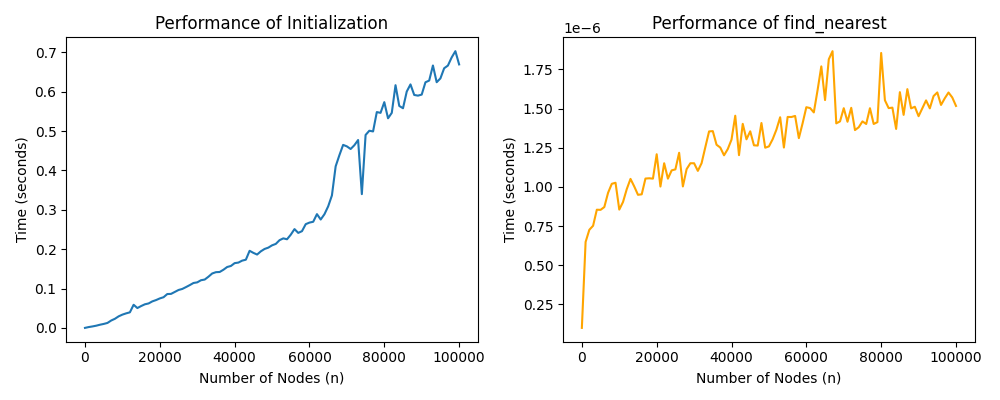

# NSW

NSW(Navigable Small World)算法的纯Python实现

## 目录

- [快速开始](#快速开始)
- [性能测试图](#性能测试图)
- [版权说明](#版权说明)

## 快速开始

```python
import random

import nsw

graph = nsw.NSWGraph(10)
points = [[random.random(), random.random(), random.random()] for _ in range(10)]
graph.add_nodes(points)
query_node = nsw.Node(None, [0.1, 0.2, 0.3])
graph.find_nearest(query_node)
```

## 性能测试图

* 1-10000个点的性能测试图
  

* 1-100000个点的性能测试图
  

* 1-100000个点的性能测试图 (CPP)
  

### 版权说明

该项目签署了Apache-2.0 授权许可，详情请参阅 LICENSE